<p align="center">
  <picture>
    <source media="(prefers-color-scheme: dark)" srcset="docs/brand/lockup-dark.svg">
    
  </picture>
</p>

<p align="center"><b>Reads a skill's eval results and says what the skill can honestly claim.</b></p>

<p align="center"><a href="https://github.com/mpwilso/mordecai/actions/workflows/ci.yml"></a></p>

Status: A portfolio project, built to show how I design, test and judge an AI tool. Version 0.3.0. Its verdict rules have been checked on simulated skills and on 12 planted skill suites with real eval runs, almost all on one small model (Claude Haiku 4.5). Only the first set of five skills and two sealed holdouts were blind; on that first set, 3 of 5 got their predicted verdict. The later suites were designed after seeing those results. Every result is in [docs/planted-skills-results.md](docs/planted-skills-results.md), including the misses. The skill library added in 0.3.0 has been tested offline only, against local Git repositories, with no model: not against github.com, not from a real MCP client, and not in a managed Claude Code install.

Mordecai is for teams that share Claude skills. Claude Code already runs a skill's test cases with and without the skill (`claude plugin eval`). Mordecai reads that result and decides what the skill can honestly claim: it helps, it hurts, the model already handles it, or there isn't enough to tell. The card it writes is tied to the exact skill, cases and model it was measured on, so a team can see when a claim has gone stale.

0.3.0 puts the verdicts to work in a [skill library](#what-the-verdicts-govern-the-skill-library): skills kept in Git, each with a base and named variants and a history for each, installed into the folder your AI coding tool reads. Install refuses a version whose card says it hurts.

It sits beside [Loupe](https://github.com/mpwilso/loupe), [Parallax](https://github.com/mpwilso/parallax), [ISR](https://github.com/mpwilso/isr) and [Polarizer](https://github.com/mpwilso/polarizer), and has no dependency on any of them.

Jump to [an example card](#what-a-card-looks-like), [the verdicts](#the-verdicts), [the skill library](#what-the-verdicts-govern-the-skill-library), [crawl mode](#crawl-mode), [how it was tested](#how-it-was-tested), [the limits](#known-limits) or [setup](#setup).

## Why it exists

Many skills don't measurably help, and the usual tools don't flag it:

- In SWE-Skills-Bench, 39 of 49 skills gave no gain in pass rate, and 24 of them passed every task without the skill. Token use moved between -78% and +451% with the results unchanged.
- In SkillsBench, skills written by people added about 16 points on average, skills written by models about -1, and 16 of 84 tasks did worse with a skill.
- `claude plugin eval` reports the change with and without a plugin, but its docs say "the with-minus-without delta is reported but never changes the exit code" ([Run evals in CI](https://code.claude.com/docs/en/plugin-evals#run-evals-in-ci)). The exit code depends on each case's score with the plugin against `--threshold`, so a skill that passes everything with or without it passes the gate. The same docs say a run that hits a usage or rate limit "usually scores 0", and the suite "isn't marked `partial`" ([Runs fail with a usage-limit or rate-limit error partway through](https://code.claude.com/docs/en/plugin-evals#runs-fail-with-a-usage-limit-or-rate-limit-error-partway-through)).

## What a card looks like

This is suite 1 from the planted check, a made-up branch and pull request convention that Claude Haiku 4.5 can't know without the skill, printed by `mordecai identify` from its real eval result ([recorded card](docs/planted-results/1-convention.card.json)).

```
$ uv run mordecai identify tests/fixtures/suite1-result.json --skill evals/planted/1-convention
planted-convention 1.0.0: Helps
The skill raised the score: 90% interval +100 to +100 points.

  With 100% · Without 0% · Change +100 pts (90% interval +100 to +100)
  Cases 9: 9 better, 0 same, 0 worse
  Fired in 27 of 27 runs that needed it, fired in 0 of 9 runs that didn't
  Cost per run $0.019 with, $0.025 without (-23%) · Turns 3.0 with, 2.0 without
  Tested on claude-haiku-4-5-20251001 · judge claude-haiku-4-5-20251001 · Claude Code 2.1.289 · 2026-10-05
  Skill sha256:f35f631cd4d5 · Cases sha256:417d28c8319e · Result sha256:d704ea283576

Warnings
  - Refused tool calls weren't checked for 72 of 72 runs: their traces are gone or outside the folders Mordecai reads.

Next: Keep it.
```

The fixture is the raw result with local paths replaced, so its result hash differs from the one in the recorded card (`sha256:06cf8a473864`), and its runs' traces aren't beside it, hence the warning. The verdict, the numbers and the other two hashes are the same.

The second example shows that one case is not evidence. It's a one-case eval of a tiny skill, run once while building Mordecai to capture the result format ([tests/fixtures/probe-result.json](tests/fixtures/probe-result.json), skill and case in [tests/fixtures/probe/](tests/fixtures/probe/)). The skill went from 0% to 100%, and the card still won't call it Helps. Its warnings are cut here.

```
$ uv run mordecai identify tests/fixtures/probe-result.json --skill tests/fixtures/probe
schema-probe 0.0.1: Inconclusive
Only 1 case(s) were compared; the rules need at least 5.

  With 100% · Without 0% · Change +100 pts
  Cases 1: 1 better, 0 same, 0 worse
  Fired in 2 of 2 runs that needed it
  Cost per run $0.019 with, $0.015 without (+23%) · Turns 3.0 with, 1.0 without
  Tested on haiku · judge haiku · Claude Code 2.1.289 · 2026-10-05
  Skill sha256:c9b400d7538f · Cases sha256:a5b22319b5ee · Result sha256:997d5873c70a
```

## The verdicts

Code decides, not a model. The rules run in this order, and the first one that applies wins. They're written out in [src/mordecai/verdict.py](src/mordecai/verdict.py).

| Verdict | When |
|---|---|
| Invalid | The eval stopped early, a run hit a usage or rate limit, judge graders were skipped, or nothing ran without the skill |
| Never fired | The skill didn't fire in any run where it should have |
| Inconclusive | Fewer than 5 cases were compared |
| Hurts | The whole 90% interval for the change is below zero |
| Helps | The whole interval is above zero, and the change is at least 10 points |
| Already handled | The model scores at least 90% without the skill, and the interval rules out both a 10-point gain and a 10-point loss |
| Inconclusive | The model scores at least 90% without the skill, but the interval doesn't rule out a 10-point loss |
| No effect | The interval stays inside plus or minus 10 points |
| Inconclusive | Anything else: the interval is too wide to call |

The interval is a bootstrap over cases, and over runs inside each case, with a fixed seed, so the same result always gives the same card. Cases that check the skill stays quiet are left out of the change and reported as misfires.

Every card also lists warnings that don't change the verdict: a model alias instead of a pinned ID, runs that ended with an error other than a usage or rate limit, runs that had a tool call refused by permissions (with how many on each side), fewer than 3 runs per side, no case that checks the skill stays quiet, no case that checks it fired, and case prompts that name the skill (which tests whether the model follows an instruction, not whether it finds the skill). `mordecai lint` runs the last four checks on case files before an eval.

A refused tool call leaves the run's `error` empty, and the result JSON has no field for it, so Mordecai reads it from each run's trace (`tracePath`): the `permission_denials` list in the trace's result message. It reads a trace only if it is inside the current directory or the `--skill` directory, as with every other path a result names. `claude plugin eval` writes traces to a temporary folder by default, so a card made after that folder is gone can't see refusals and doesn't warn.

**The two Already handled rows changed in 0.2.0.** Under the original rules, Already handled only checked that the interval ruled out a 10-point gain. In the planted check, that hid harm. An outdated skill (suite 3) gave the wrong answer in 5 of the 6 runs where it fired, and the card still said Already handled, with an interval of -41 to +7. The rules never flagged that skill as Hurts, and the new rules don't either, because its interval reaches +7. They now call it Inconclusive. The change was designed after seeing that result, so suite 3 can't count as evidence for it. Of the seven cards recorded before the change, it moves only suite 3.

## What the verdicts govern: the skill library

A card says whether a skill helps. The library, added in 0.3.0, is what acts on that: it keeps skills in Git, and its install refuses a version whose card says it hurts. [docs/library.md](docs/library.md) is the full guide, [docs/library-demo.md](docs/library-demo.md) a walk-through that runs in seconds with no model, and [docs/library-design.md](docs/library-design.md) the design.

- **Base and variants.** Each skill has a base and named variants (a team's or a person's own version), each a plain skill folder that passes the spec's reference validator, with its own semver version and changelog. A release is a local Git tag, `skill/<skill>@X.Y.Z` or `skill/<skill>.<variant>@X.Y.Z`. Each variant records the base version it is based on, and `status` reports one that falls behind. Nothing is merged.
- **The gate.** A version can carry a card and the eval result it was made from. The library doesn't trust the verdict written in the card: it checks the result is the card's, reruns the rules on it, and checks the card's hashes against that version's files. Install always refuses Hurts, Invalid and a card that doesn't match its result, and warns when there's no card or the card is for other files. No config file can drop those refusals; only `--allow`, typed at the command line for one install, overrides one.
- **Install.** `mordecai library install` copies the resolved folder byte for byte into `.agents/skills/` (Codex, Cursor, Copilot), `.claude/skills/` or another tool's folder, and records the source, commit, version, hash and verdict in `mordecai-lock.json`. `update` shows a diff first. Installed skills are loaded by the tool from their description, the way they were measured; reading one over MCP only happens if the model decides to call a tool.
- **Sources.** A config lists GitHub repositories or local folders, org then team then personal, and for each copy the one listed last wins. Access control is GitHub's.
- **For an organization.** `export --marketplace` writes the resolved skills as a Claude Code plugin marketplace that managed settings can restrict users to and install for everyone ([example](examples/managed-settings.json)). Exports never include a refused copy.
- **MCP.** `mordecai mcp` serves list, search, read, history, update checks, install and uninstall. Install and uninstall write only to configured targets, can't override the gate, and are marked destructive so a client asks first. `get_skill` returns text someone else wrote, which a model may read as instructions. This repository's [.mcp.json](.mcp.json) lets you try the server in Claude Code without touching your user config.

In the seeded library, two variants carry real cards from the planted check. Their skill folders are byte for byte the planted skills, and their cards were made with `mordecai identify` from the recorded results (with local paths made relative; each evidence folder's NOTE.md gives the original hash):

| Copy | Planted suite | Card | Install |
|---|---|---|---|
| `ferry-workflow` variant `qrx` | 1, a made-up convention | Helps (+100) | installs |
| `branch-naming` variant `camelcase` | H1, a convention its eval's graders reject | Hurts (-100) | refused |

The rest of the seeded library is unmeasured and says so.

### Limits of the library

- **The gate trusts committed result files.** It checks that a card matches its result and its version's files, not that the eval really ran. A fabricated result with a card made from it would pass.
- **Cards are only as good as their cases.** A Helps card says the skill helped on those cases, with that model. See [the verdicts](#the-verdicts) and [known limits](#known-limits).
- **Precedence is by rule, not merge.** The last source listed wins for each copy, and a variant behind its base is reported, not updated.
- **Nothing writes to GitHub.** Releases are local tags, and pushing them is up to you. There is no GitHub Action yet that posts a card on a library pull request.
- **The Hurts example is deliberately harmful.** `branch-naming`'s `camelcase` variant is planted suite H1, a convention built to fail its own eval's graders. It is never published, and every export refuses it.
- **This repository publishes only one skill at its root,** `mordecai`, in [skills/](skills/), for npx skills and APM. The seeded skills are demo content. Don't run `npx skills add --full-depth` on this repository: that searches everything, including the planted suites' deliberately harmful skills.
- **Mordecai isn't a general package manager.** It installs only skills, only from Mordecai libraries, and keeps its own lockfile beside npx skills' and APM's without touching theirs.
- **No size limit on fetches.** A Git fetch stops after five minutes, but can download a repository of any size into the cache before then.
- **Tested offline only.** GitHub fetching was tested against a local stand-in, the MCP client snippets in the guide haven't been run in their clients, and the marketplace export hasn't been tried in a managed Claude Code install. A clone without the library's release tags reads every copy as untagged.

## Crawl mode

`--crawl`, or `MORDECAI_MODE=crawl`, prints the same card as loot, in honor of Matt Dinniman's *Dungeon Crawler Carl*. Helps is ENCHANTED, Hurts is CURSED, Already handled is VENDOR TRASH, and Mordecai has opinions. On a terminal, the box opens first.

<p align="center"></p>

<p align="center"><sub>A demo skill with simulated results. The text is printed by the same code as the command.</sub></p>

The jokes come from fixed templates around the plain card's stat block. They can't change a number or a verdict, and a test checks that every number in crawl mode is also in plain mode.

Crawl mode is a fan nod. It isn't affiliated with or endorsed by the author or publisher, and its text is original.

## How it was tested

### Planted skills, run for real

Each planted skill has a known intended effect, and every prediction was committed before its suite ran. **Only some of the suites were blind.** The first set of five skills and the two sealed holdouts were written and predicted before any result existed: their predictions are in commit bd92b23 ([docs/planted-skills.md](docs/planted-skills.md)), and the first results start at commit 15da64f. Everything after that (V1, V2, V3, H1 and both Sonnet reruns) was designed or predicted after seeing earlier results. Each suite has 12 cases: 9 compared, and 3 where the skill should stay quiet. Every suite ran with 3 runs per side and regex or tool-use graders only. Details, cards and costs are in [docs/planted-skills-results.md](docs/planted-skills-results.md).

**First set, 0.1.0 rules, Claude Haiku 4.5: 3 of 5 skills got their predicted verdict.** The criterion written in advance was that every suite gets its predicted outcome, so the check as a whole failed.

| Suite | Predicted | Actual | |
|---|---|---|---|
| 1. A made-up convention | Helps | Helps (+100) | Match |
| 2. Conventional Commits | Already handled | Helps (+78) | Miss. Haiku rarely uses the format unprompted (5 of 27 runs), so the premise was wrong |
| 3. An outdated rule | Hurts | Already handled (-15) | Miss. The skill fired in 6 of 27 runs; see the verdicts section |
| 4. A vague description | Never fired | Never fired | Match |
| 5a. A twin placebo | Not Helps or Hurts | Already handled | Match. Every run agreed, so there was no noise to misread |
| 5b. A filler placebo | Not Helps or Hurts | No effect | Match. Every run agreed |

**Later suites, 0.2.0 rules, frozen at 64a7701.** V1, V2, V3 and H1 were written after the first results, so they are not blind. Holdouts 6 and 7 were written with the first set, before any result, and each ran once.

| Suite | Predicted | Actual | |
|---|---|---|---|
| V1. An outdated rule meant to fire | Hurts | Inconclusive (-11) | Miss. The skill fired in 1 of 27 runs |
| V2. Meant as a noisy placebo | Not Helps or Hurts | Hurts (-37) | Design defect. Its text ("Say what changed in plain words") changed behavior, and the rules read that real effect correctly |
| V3. An inert placebo on V2's cases | Not Helps or Hurts | Inconclusive (-11, interval -33 to +11) | Match. It fired in 27 of 27 runs, on noisy runs |
| Holdout 6. A made-up changelog format | Helps | Helps (+100) | Match |
| Holdout 7. A filler placebo | Not Helps or Hurts | No effect | Match, but weak evidence: its baseline was 0%, so it could only have shown a false gain, and its text isn't inert |
| H1. A made-up convention that conflicts with the graders | Hurts | Hurts (-100) | Match. It fired in 27 of 27 runs. Designed after seeing results, so that the skill would fire |

What these show:

- **No placebo has been called Helps or Hurts, but only one placebo ran on noisy runs.** That was V3, which was not blind. Its skill fired every time, its runs disagreed often (all 3 runs agreed in 16 of 24 case-and-side cells), and its card said Inconclusive. The other placebos (5a, 5b and holdout 7) had no noise to misread. V2's Hurts was a real effect from an instruction in its text, not a false call.
- **Hurts was detected once, and it depends on the skill being opened.** The only Hurts on a harmful skill was H1, a suite designed after seeing results so that its skill would fire in every run. When a harmful skill fired in 6 of 27 runs (suite 3, blind) or 1 of 27 (V1), the rules didn't call Hurts. Those cards said Already handled and Inconclusive. This doesn't show that Hurts detection is reliable.
- **Real runs were much less noisy than the simulation assumed.** In the first set, all 3 runs of a side agreed in 94% of case-and-side cells.

Total cost of the planted runs: $20.60 at list price, across 15 runs, one of them a $0.25 pilot.

### Model comparisons

Two suites were rerun on Claude Sonnet 5.5 (`claude-sonnet-5-5`). Neither verdict moved, so no drift was caught. The first rerun had no written prediction; the second was predicted after seeing the Haiku card. Suite 1 stayed Helps (+100 on both models). Suite 2 stayed Helps, but its baseline went down, not up: Sonnet used a Conventional Commits prefix unprompted in 0 of 27 runs, against Haiku's 5. The change grew from +78 to +100. Both cards in each pair match the same skill and case files, so only the model tells them apart. `mordecai check --model` reports that difference in the record (see [setup](#setup)). It doesn't show that a verdict changed.

### Simulation

[docs/simulation.md](docs/simulation.md) runs the rules on simulated skills with a known effect, 200 suites per row. The first simulation treated every run as an independent coin flip, which makes 3 runs agree only about a third of the time. Real runs agreed 94% of the time, so that assumption didn't match. Rerun at 94% agreement:

- **A placebo was called Helps or Hurts in 0% of suites**, against up to 4% with coin flips.
- **A skill worth +20 points was called Helps in 13%, 36% and 56% of suites at 5, 10 and 15 cases.** That's almost the same as with coin flips (14%, 35% and 52%). The remaining uncertainty is between cases, not between runs: a +20 point skill changes the outcome of only some cases. In simulation, a moderate effect needs well over 15 cases to be called reliably. **This finding hasn't been tested on real runs:** no planted skill had a moderate effect.
- **A skill worth +40 points was called Helps in 80% of suites at 10 cases and 96% at 15.**

### Unit tests

Each verdict and warning has a test on a constructed result, along with hashing, staleness, relative card paths, `lint`, `check --model` and the command line. Others feed in hostile input: malformed results and cards, paths and links that lead outside the plugin, and names carrying terminal escapes or Markdown. One test is built from the real suite 3 result, and others check that the README's example cards are what the tool prints. The library's tests cover every command, including hostile sources and targets (path traversal, links, malformed frontmatter, a name that doesn't match its folder, a card that doesn't match its version's files or its result), the byte-for-byte install, the seeded library, and the MCP server through the SDK's in-process client and over stdio. `uv run pytest` runs 181 tests without the library extra (the library's test files skip), and 363 with it (`uv sync --extra library --group spec`). None call a model or reach the network. CI ([.github/workflows/ci.yml](.github/workflows/ci.yml)) runs the tests, lint, the format check, `scripts/brand.py --check` and `scripts/planted.py --check` on Python 3.11, 3.12 and 3.13, on every push and pull request, and runs the tests again with the library extra. Live eval runs are never part of CI: they call a model and cost money, and CI has no secrets. The result format comes from a real `claude plugin eval` run, not from the docs alone.

### What wasn't checked

- **Other models.** Everything ran on Claude Haiku 4.5, except two suites rerun on Claude Sonnet 5.5.
- **Judge-graded suites.** Every grader was a regex or a tool-use check, so judge disagreement was never in play.
- **Skills with a moderate real effect,** somewhere around +10 to +30 points. The changes measured on the planted cards were -100, -37, -15, -11, 0, +78 and +100.
- **A harmful skill that fires in some runs but not others.** The rules gave Already handled (0.1.0) or Inconclusive (0.2.0) in those cases, and there is no verdict for it.
- **Domains other than git workflow and Python project setup.**
- **Invalid and partial results from real runs.** No real run hit a cost cap or a rate limit, so those paths are tested only on constructed results.
- **Using `--fail-on` as a CI gate on a real repository.**

## Known limits

- **Hurts needs the skill to be opened.** A harmful skill that fires rarely gets Inconclusive, or Already handled under the 0.1.0 rules, not Hurts. Check the card's "Fired in" line.
- **A skill that rarely fires is reported as Inconclusive.** V1's skill fired in 1 of 27 runs, and its card says Inconclusive, the same word used for a wide interval. A fix is proposed in [docs/open-questions.md](docs/open-questions.md): a Rarely fired verdict under a 10% fire rate, and a warning under 50%. It isn't applied.
- **The bootstrap is optimistic when runs agree.** In 8 of the 13 planted cards that have an interval, it collapsed to a single point, such as +100 to +100.
- **Results come from one small model.** See [what wasn't checked](#what-wasnt-checked).
- **Only one plugin per result.** Cards name the first plugin in the suite.
- **Refused tool calls are seen only in kept traces.** The permissions warning needs each run's trace, inside the current directory or `--skill`. Without the traces a card can't tell a refused tool call from a skill that did badly. A refusal never changes the verdict; whether it should is an [open question](docs/open-questions.md#open-question-4-runs-that-say-nothing-about-the-skill).
- **Cost, not tokens.** The eval result reports each run's estimated cost at list price, not its tokens, so that's what the card compares.
- **Links aren't followed.** A symbolic link in a skill is hashed as the path it points to, never opened, so a card doesn't go stale when the linked file's contents change. This keeps a skill under review from making Mordecai read files outside it.

## Setup

Requires Python 3.11 or later and [uv](https://docs.astral.sh/uv/).

```
git clone https://github.com/mpwilso/mordecai
cd mordecai
uv sync
```

`uv sync` is enough for `identify`, `check` and `lint`, which use only the standard library. The skill library and its MCP server need `uv sync --extra library`; see [its guide](docs/library.md#setup).

Check your cases, run your skill's eval with a pinned model, then read it:

```
uv run mordecai lint path/to/plugin
claude plugin eval path/to/plugin --trust-plugin --model claude-sonnet-5-5 --json result.json --no-publish --max-cost-usd 5
uv run mordecai identify result.json --skill path/to/plugin --card card.json --markdown card.md
uv run mordecai check card.json --model claude-sonnet-5-5
```

**`claude plugin eval` runs the plugin's code on your machine, as you.** Under `--json` it can't ask whether you trust the plugin directory, so it refuses to run unless you pass `--trust-plugin` or have already trusted the directory. Only pass it for a plugin you've reviewed and would run yourself. Mordecai itself never runs a plugin: it reads the result file and hashes the plugin's files.

- `lint` exits 1 if the case files would get any warning.
- `identify` prints the card, and can write it as JSON and as Markdown for a pull request. `--fail-on hurts,invalid` makes it exit 1 on those verdicts, for CI. `--crawl` or `MORDECAI_MODE=crawl` prints crawl mode, and `--plain` overrides the variable.
- `check` exits 1 when the skill or its cases have changed since the card was written. With `--model`, it also exits 1 when the card was measured on a different model.
- Every command exits 2 when it can't read its input or won't use it, with one line saying why.

Cards store paths relative to where the card is written, so a card still checks after the repository is cloned somewhere else. Run Mordecai from the repository root: it reads only inside the current directory and directories you pass with `--skill` or `--cases-root`, since a result or card may come from someone else.

A worked example from the planted check: suite 2's Haiku card still matches its files, but it is stale for Sonnet.

```
$ uv run mordecai check docs/planted-results/2-commits.card.json --model claude-sonnet-5-5
Stale: docs/planted-results/2-commits.card.json
  - The card was measured on claude-haiku-4-5-20251001, not claude-sonnet-5-5.
```

## How it relates to the author's other tools

Mordecai has no dependency on any of them.

- [Loupe](https://github.com/mpwilso/loupe) and [ISR](https://github.com/mpwilso/isr) are skills. A team could keep them in a Mordecai library and measure them; neither is in the seeded library.
- [Parallax](https://github.com/mpwilso/parallax) runs agents that plan, build and check work in a sandbox. It doesn't install skills, and Mordecai doesn't run agents.
- [Polarizer](https://github.com/mpwilso/polarizer) is a local MCP gateway that pins tool definitions, holds risky calls for a person and keeps a verifiable ledger. It can sit in front of `mordecai mcp`; [docs/library.md](docs/library.md#setup) has an unverified example.

## What's next

1. A way to report a skill that rarely fires, distinct from Inconclusive (see [known limits](#known-limits)).
2. A planted skill with a moderate effect, to check the simulation's +20 point finding on real runs.
3. `mordecai measure`: run the eval with a pinned model and a cost cap, then write the card, in one step.

## Prior art

- [`claude plugin eval`](https://code.claude.com/docs/en/plugin-evals) runs the cases, both arms and the graders. Mordecai only reads its result.
- [SWE-Skills-Bench](https://arxiv.org/abs/2603.15401) and [SkillsBench](https://arxiv.org/abs/2602.12670) measured how often skills help, with and without.
- [NVIDIA SkillEvaluator](https://developer.nvidia.com/blog/evaluating-ai-agent-skill-performance-with-nvidia-skillevaluator/) reports a with-minus-without "skill lift", and says it doesn't report confidence intervals. NVIDIA's [skills catalog](https://docs.nvidia.com/skills/evaluating-agent-skills) gates publication on a with-and-without eval, and [Tessl's registry](https://tessl.io/blog/introducing-task-evals-measure-whether-your-skills-actually-work/) shows with-and-without scores for each version.
- [npx skills](https://github.com/vercel-labs/skills) and [APM](https://github.com/microsoft/apm) install skills with lockfiles. Mordecai's library coexists with both and doesn't replace them.
- Skill MCP servers such as [agentskills-mcp](https://github.com/pinkpixel-dev/agentskills-mcp) and [tiger-skills-mcp-server](https://github.com/timescale/tiger-skills-mcp-server) list, read and install skills, and registries such as [Speakeasy's](https://www.speakeasy.com/docs/ai-control-plane/mcp-gateway/skills) track versions and drift. None of those gates an install on a measured result for that version's files. [docs/research.md](docs/research.md) has the comparison.

## License

MIT. See [LICENSE](LICENSE).
